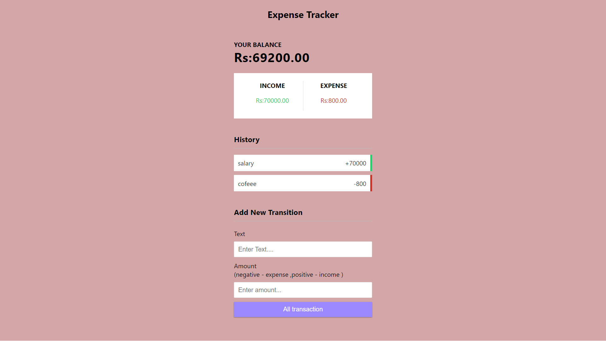

 ## Description

This project is an expense tracker application that helps users manage their finances by tracking income and expenses. Users can add transactions with descriptions and amounts, and the application calculates and displays the total balance, income, and expenses. It also allows users to delete transactions, and all data is saved in the browser's local storage for persistence. The interface dynamically updates to reflect changes in the transaction list and financial summaries.

# Screenshots

## Features
- Add Transactions
- Delete Transactions
- Display Transactions
- Dynamic Styling (Income/Expense)
- Total Balance Calculation
- Income Calculation
- Expense Calculation
- Persistent Storage (Local Storage)
- Responsive Balance Updates
- Alerts for Form Validation

## Author

Sujal Naphade

